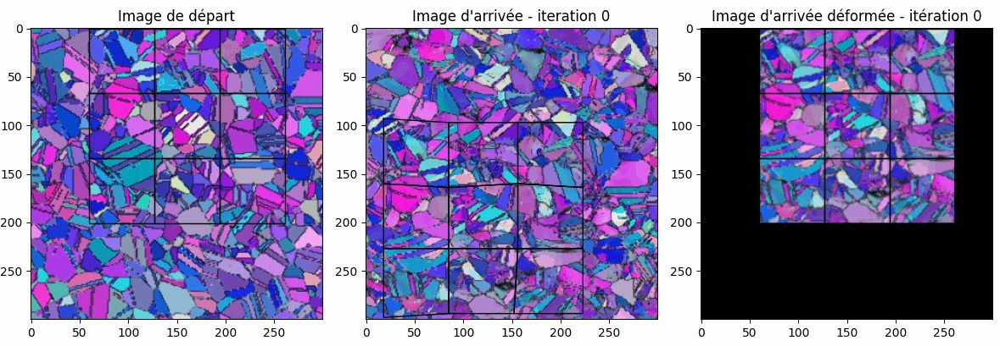
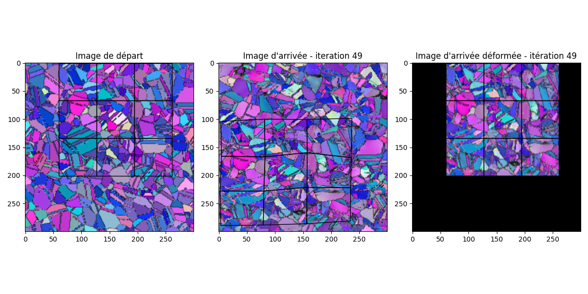
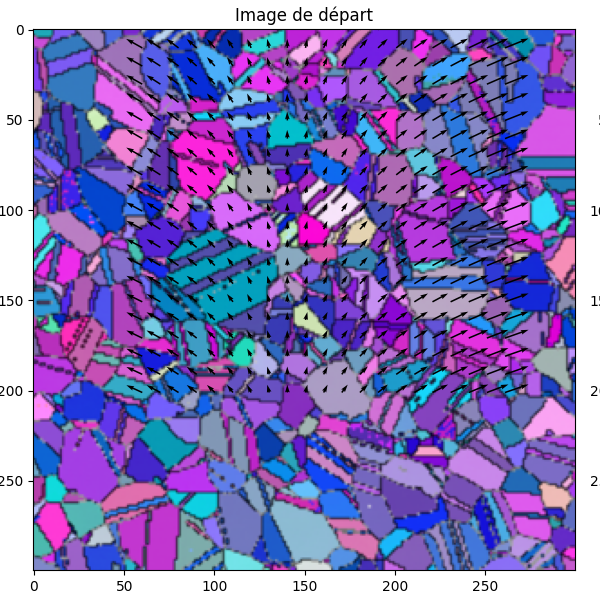

# Microscopic Image Alignment for Material Deformation Analysis

## Overview

This repository contains a Python script implementing a method for aligning microscopic images to analyze material deformations. The primary objective is to develop an alignment method that optimally overlays two images, allowing for the exploration and analysis of material deformations at the microscale. The results demonstrate the effectiveness of this approach and open avenues for applying artificial intelligence solutions to predict material deformations.

This research work was undertaken as part of a master's degree internship, conducted jointly within two renowned research laboratories:

- **LORIA (Laboratoire Lorrain de Recherche en Informatique et ses Applications)**
- **LEM3 (Laboratoire d’Etude des Microstructures et de Mécanique des Matériaux)**


The project is conducted under the supervision of the following mentors:

- Frédéric Pennerath - frederic.pennerath@centralesupelec.fr
- Brieuc Conan-Guez - brieuc.conan-guez@univ-lorraine.fr
- Lydia BOUDJELOUD - lydia.boudjeloud-assala@univ-lorraine.fr
- Antoine Guitton - antoine.guitton@univ-lorraine.fr
- Benoît Beausir - benoit.beausir@univ-lorraine.fr
- Satyaveer Dhinwal - satyaveer.dhinwal@univ-lorraine.fr
- Vincent Taupin - vincent.taupin@cnrs.fr

## Parameters

Before running the script, make sure to configure the following parameters in the script (`main.py`):

1. **Input Images:**
    - `before_image_name`: Path to the image of the material before the application of stress.
    - `after_image_name`: Path to the image of the material after the application of stress.

2. **Region of Interest (ROI):**
    - `start_bbox`: Tuple representing the starting bounding box coordinates for defining the region of interest in the 'before' image.
    - `end_bbox`: Tuple representing the ending bounding box coordinates for defining the region of interest in the 'after' image.
    - `m` and `n`: Height and width of the grids.
    - `x_s`, `y_s`: Down-left point coordinates for the start grid.
    - `x_e`, `y_e`: Down-left point coordinates for the end grid.

4. **Grid Size:**
    - `grid_size`: Tuple representing the grid size.

5. **Learning Rate:**
    - `lr`: Learning rate for the optimization process.

6. **Output Path:**
    - `test_name`: Path to save the output images.

## Usage

1. Clone the repository:

    ```bash
    git clone https://gitlab-research.centralesupelec.fr/pennerath/maminova
    ```


2. Navigate to the project directory:

    ```bash
    cd maminova
    ```

3. Install the required dependencies:

    ```bash
    pip install -r requirements.txt
    ```

4. Run the main script:

    ```bash
    python main.py
    ```

    Follow the prompts during training to continue or stop.

## Results

- Training results, including displacement vector fields and intermediate images, will be saved in the output folder.

## Testing example

Here is an example demonstrating the output of the alignment process:

- First iteration: 
- Last iteration: 
- Displacement field: 

**Description:**
- For this example, the material used is Inconel.
We have the start image "image de départ" and the end image "image d'arrivée" of the material. The material was subjected to the process of uniaxial tensile.
- The displacement vectors serve as indicators of how the material responds to the applied force. When a uniaxial tensile force is applied to both ends of a material, the ends of the material tend to undergo significant elongation. In contrast, the central part of the material may appear to remain relatively fixed or undergo less pronounced elongation. This is observable by the arrows at the ends, which are more extended than those in the central part.


|Size of the region to be aligned| Alignment criteria value| Execution time |
| -------------- | ------------------- | -------------- |
| 200 x 200      | 0.0414              | 126 s          |

For further explanation, you can refer to the file "Rapport_PFE_Hamza_Azizi.pdf"

## Contact

- Hamza AZIZI
- Email: hamza.azizi@dauphine.eu
